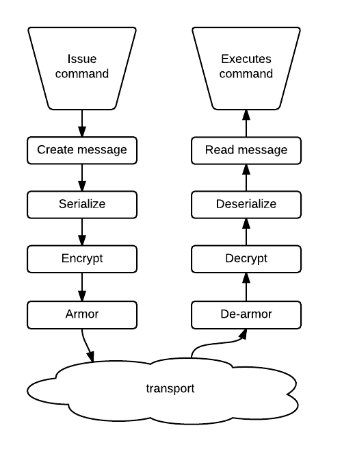

# Outgoing transport layer

This document examines the program flow from the point a command is issued till it is put on the ZMQ socket.

## Bird eye view
After a command is issued the resulting message is transformed several times before being put on the wire and back again when received.

1. Command is issued by user.
2. The command is serialized.
3. Then encrypted.
4. Then [armored](armoring.md).
5. Finally send.

## Conceptual steps
For each RPC `<command>`:

1. Create an `OTMessage` object in `OT_API::<command>` (`OpenTransactions.cpp`)
  1. (Deprecated, only for few commands) Pass command type, arguments and
     message instance to `OTClient::ProcessUserCommand`. Inside the mother of
     all switch-case statements, there is a `case` statement that matches the
     command type. The code is being updated to move all message construction
     steps to `OT_API`.
  1. Set message command type `m_strCommandType` to string representation of
     `<command>`
  1. Set other `OTMessage` attributes necessary for the RPC call.
  1. Set the request number.
  1. Sign the message with the Nym's signing key.
  1. Pass message instance to `OTServerConnection::ProcessMessageOut`
    1. Serialize `OTMessage` into string with XML/Signature sections
    1. Encrypt ("seal") string to the servers public key (determined from server contract)
    1. After some callback tango, go to `OT_API::TransportFunction`
      1. Armor (base64-encode) and send over ZeroMQ

## Exhaustive trace

### Supporting concepts
There are three different concepts which play a pivotal role in messaging.

#### Request
The request is a generic object of type `OTAPI_Func` which has embedded in it
the _type of request_ and _all required parameters_ for that request. For
example creating an account or doing a transaction. The variable containing
this concept is always called `theRequest`.

#### Message
Once the request is executed a message is constructed. This message holds not
only the passed arguments but also some bookkeeping in the form of request
numbers and signatures. The variable is called `theMessage` and of type
`OTMessage`.

#### Envelope
A message is eventually converted to `theEnvelope` (which is not an entirely
accurate description). This is a serialized, armored message. This is what is
put on the wire. The variable is called `theEnvelope` and of type `OTEnvelope`.

### Code step through for `CreateAssetAccount`

This is a sample trace for one that involves the deprecated message generation
using `ProcessUserCommand`:

1. [(`MadeEasy::create_asset_acc`, `ot_made_easy_ot`)](https://github.com/Open-Transactions/opentxs/blob/5c6e032db826797d49f58d8285c02c7368fac149/src/client/ot_made_easy_ot.cpp#L377) The methods defined in the class MadeEasy generally refer to a `theRequest` object which is an instance of `OTAPI_Func` (no idea where it is instantiated).
2. [(`OTAPI_Func::SendRequest`, `ot_otapi_ot`)](https://github.com/Open-Transactions/opentxs/blob/5c6e032db826797d49f58d8285c02c7368fac149/src/client/ot_otapi_ot.cpp#L996) On that object `SendRequest` is called, which is defined in on the class `OTAPI_Func`.
3. [(`OTAPI_Func::SendRequestOnce`, `ot_otapi_ot`)](https://github.com/Open-Transactions/opentxs/blob/5c6e032db826797d49f58d8285c02c7368fac149/src/client/ot_otapi_ot.cpp#L1013) `SendRequest` calls `SendRequestOnce`.
4. [(`OTAPI_Func::SendRequestLowLevel`, `ot_otapi_ot`)](https://github.com/Open-Transactions/opentxs/blob/5c6e032db826797d49f58d8285c02c7368fac149/src/client/ot_otapi_ot.cpp#L774) `SendRequestOnce` calls `SendRequestLowLevel`.
5. [(`OTAPI_Func::Run`, `ot_otapi_ot`)](https://github.com/Open-Transactions/opentxs/blob/5c6e032db826797d49f58d8285c02c7368fac149/src/client/ot_otapi_ot.cpp#L675) `theRequest` is being passed around in steps 2-4 and eventually `Run` is called on it.
6. [(`OTAPI_Wrap::createAssetAccount`, `OTAPI`)](https://github.com/Open-Transactions/opentxs/blob/5c6e032db826797d49f58d8285c02c7368fac149/src/client/OTAPI.cpp#L2096) Based on whatever type the `theRequest` object has a function defined on the class `OTAPI_Wrap` is called. For example `OTAPI_Wrap::createAssetAccount`.
7. [(`OPAPI_Exec::createAssetAccount`, `OTAPI_Exec`)](https://github.com/Open-Transactions/opentxs/blob/5c6e032db826797d49f58d8285c02c7368fac149/src/client/OTAPI_Exec.cpp#L13782) `OTAPI_Wrap` delegates to `OTAPI_Exec`.
8. [(`OT_API::createAssetAccount`, `OpenTransactions`)](https://github.com/Open-Transactions/opentxs/blob/5c6e032db826797d49f58d8285c02c7368fac149/src/client/OpenTransactions.cpp#L13196) Which delegates to `OT_API`.
9. (`OT_API`, `OpenTransactions`) In the createAssetAccount method `theMessage` is constructed, fields are being populated (like `m_strCommand` and `m_strAssetID`)..
10. [(`OT_API`, `OpenTransactions`)]() All the while a couple of magically defined variables is accessable and passed as arguments. Eg: `serverID, nymID, assetID`.
11. [(`OT_API`, `OpenTransactions`)](https://github.com/Open-Transactions/opentxs/blob/5c6e032db826797d49f58d8285c02c7368fac149/src/client/OpenTransactions.cpp#L13241) `theMessage` is saved (to disk?) with `SaveContract`.
12. [(`OTClient::ProcessMessageOut`,`OTClient`)](https://github.com/Open-Transactions/opentxs/blob/5c6e032db826797d49f58d8285c02c7368fac149/src/client/OTClient.cpp#L203) Goes to `ProcessMessageOut` in `OTClient` which stringyfies `theMessage` (In what order? That seems to matter a few steps down.).
  1. Stringyfying goes but making a new OTString object and passing `theMessage` (which is an OTMessage, which is a subclass of OTContract) to the constructor.
  2. The constructor calls `SaveContractRaw` with the message. And does some casting dance.
  3. Which calls `Get` on the `m_strRawfile` (not sure how that got populated or why this is a file all of the sudden).
  4. This just casts to a char pointer (from already a char pointer?).
13. [(`OTClient`,`OTClient`)]() Which then delegates to `ProcessMessageOut` in `OTServerConnection`.
14. [(`OTServerConnection::ProcessMessageOut`,`OTServerConnection`)](https://github.com/Open-Transactions/opentxs/blob/5c6e032db826797d49f58d8285c02c7368fac149/src/client/OTServerConnection.cpp#L623) The first character in the character buffer which was once `theMessage` determines how with function is passed into ProcessUserCommand, which populates a new `theMessage`.
  1. The buffer seems really small. Only a [couple of characters](https://github.com/Open-Transactions/opentxs/blob/a29d030669b87308509ee0c29a6016f39c7fa6e0/src/client/OTServerConnection.cpp#L833) long.
15. [(`OTServerConnection::ProcessMessageOut`,`OTServerConnection`)](https://github.com/Open-Transactions/opentxs/blob/5c6e032db826797d49f58d8285c02c7368fac149/src/client/OTServerConnection.cpp#L559) Flow is then directed to yet an other `ProcessMessageOut` this time _only_ accepting an `theMessage`.
16. [(`OTServerConnection`,`OTServerConnection`)](https://github.com/Open-Transactions/opentxs/blob/5c6e032db826797d49f58d8285c02c7368fac149/src/client/OTServerConnection.cpp#L580) `theEnvelope` is filled with the content of `theMessage` with the `SaveContractRaw` method.
17. [(`OTServerConnection`,`OTServerConnection`)](https://github.com/Open-Transactions/opentxs/blob/5c6e032db826797d49f58d8285c02c7368fac149/src/client/OTServerConnection.cpp#L583) the content is then encrypted with the `Seal` method.
18. [(`OTServerConnection`,`OTServerConnection`)](https://github.com/Open-Transactions/opentxs/blob/5c6e032db826797d49f58d8285c02c7368fac149/src/client/OTServerConnection.cpp#L587) and finally armored with the `SetEnvelope` method.
19. [(`OTServerConnection`,`OTServerConnection`)](https://github.com/Open-Transactions/opentxs/blob/5c6e032db826797d49f58d8285c02c7368fac149/src/client/OTServerConnection.cpp#L590) A header is constructed.
  1. The header contains how long a message is and what the type of the message is.
  2. Type of the message is defined by two integers. Presumably the server knows.
  3. I don't think the header is actually used (https://github.com/Open-Transactions/opentxs/blob/develop/src/client/OTServerConnection.cpp#L590).
20. [(`OTServerConnection`,`OTServerConnection`)](https://github.com/Open-Transactions/opentxs/blob/5c6e032db826797d49f58d8285c02c7368fac149/src/client/OTServerConnection.cpp#L610) The member field containing `Callback` is called with `ServerContract` and `theEnvelope`.
  1. `ServerContract` is a member field of the `OTServerConnection` class.
  2. Presumably this sends the message.
21. [(`OTServerConnection::SetFocus`,`OTServerConnection`)](https://github.com/Open-Transactions/opentxs/blob/5c6e032db826797d49f58d8285c02c7368fac149/src/client/OTServerConnection.cpp#L221) `Callback` is set in the `SetFocus` method and is of type `TransportCallback`.
22. [(`OTClient::SetFocusToServerAndNym`,`OTClient`)](https://github.com/Open-Transactions/opentxs/blob/5c6e032db826797d49f58d8285c02c7368fac149/src/client/OTClient.cpp#L13747) `SetFocus` is called in `OTClient` in `SetFocusToServerAndNym`.
23. [(`OT_API::GetTransportCallback`, `OpenTransactions`)](https://github.com/Open-Transactions/opentxs/blob/5c6e032db826797d49f58d8285c02c7368fac149/src/client/OpenTransactions.cpp#L819) Eventually it boils down to the `GetTransportCallback` method in `OpenTransactions.cpp`, which is a glorified getter.
24. [(`OPAPI_Exec`, `OTAPI_Exec`)](https://github.com/Open-Transactions/opentxs/blob/5c6e032db826797d49f58d8285c02c7368fac149/src/client/OTAPI_Exec.cpp#L214) The corresponding setter `SetTransportCallback` is called in `OTAPI_Exec`.
25. [(`TransportCallback`, `TransportCallback`)](https://github.com/Open-Transactions/opentxs/blob/5c6e032db826797d49f58d8285c02c7368fac149/src/client/TransportCallback.cpp) This is fed a new instance of `TransportCallback` in which the only constructor argument is a new instance of `OT_API` (defined in `OpenTransactions.cpp`) constructed without any arguments.
  1. `TransportCallback` is just a wrapper, doing nothing really.
  2. It does define an `operator` function which takes a server contract and envelop.
26. [(`OT_API`, `OpenTransactions`)]() I believe the `operator` function is called at some point. This delegates to `TransportFunction` on `OT_API`.
27. [(`OT_API`, `OpenTransactions`)](https://github.com/Open-Transactions/opentxs/blob/5c6e032db826797d49f58d8285c02c7368fac149/src/client/OpenTransactions.cpp#L1183) After a whole bunch of checks the envelope is armoured and the server address is cobbled together.
28. [(`OTSocket::Send`,`OTSocket`)]() These two are then passed to the `Send` method of the `OTSocket` class.
29. [(`OTSocket_ZMQ_4::Send`,`Socket_ZMQ4`)](https://github.com/Open-Transactions/opentxs/blob/5c6e032db826797d49f58d8285c02c7368fac149/src/ext/Socket_ZMQ4.cpp#L509) Which really is implemented in the `OTSocket_ZMQ_4` class.
30. [(`OTSocket_ZMQ_4::Send`,`Socket_ZMQ4`)](https://github.com/Open-Transactions/opentxs/blob/5c6e032db826797d49f58d8285c02c7368fac149/src/ext/Socket_ZMQ4.cpp#L389) After again a bunch of checks it _finally_ [creates](https://github.com/Open-Transactions/opentxs/blob/aea45331aa5b567fdee8500f90629e1a0046be8e/src/ext/Socket_ZMQ4.cpp#L422) a ZMQ message.
